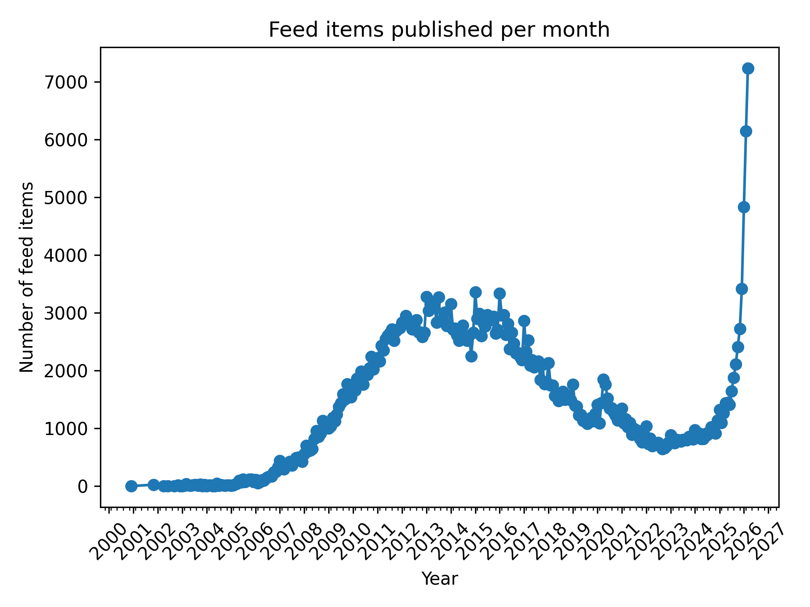
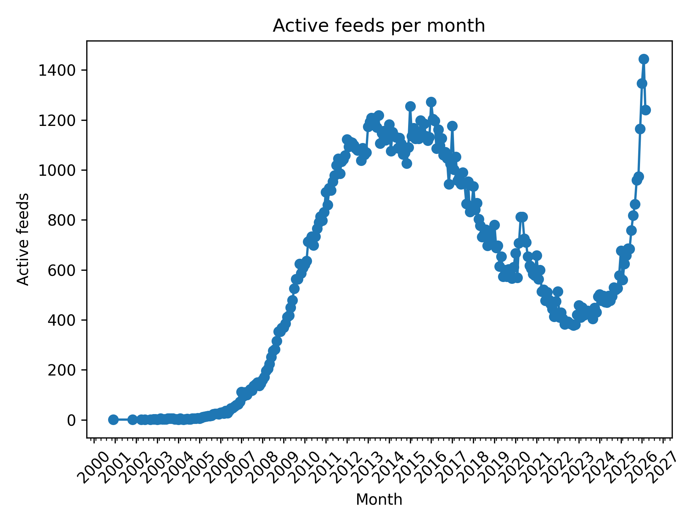
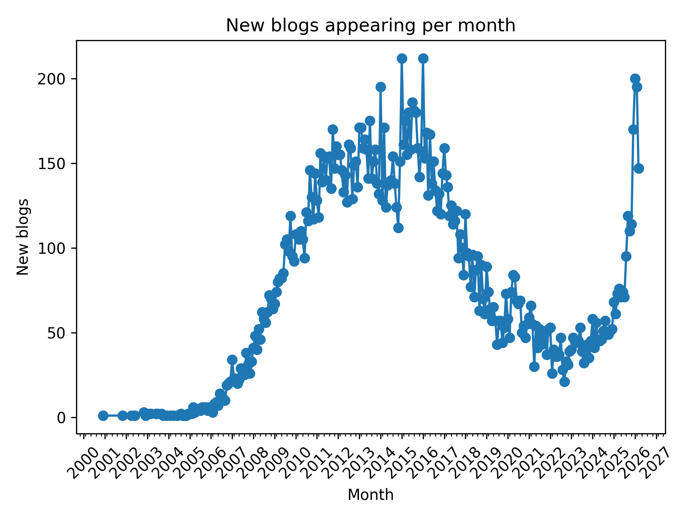
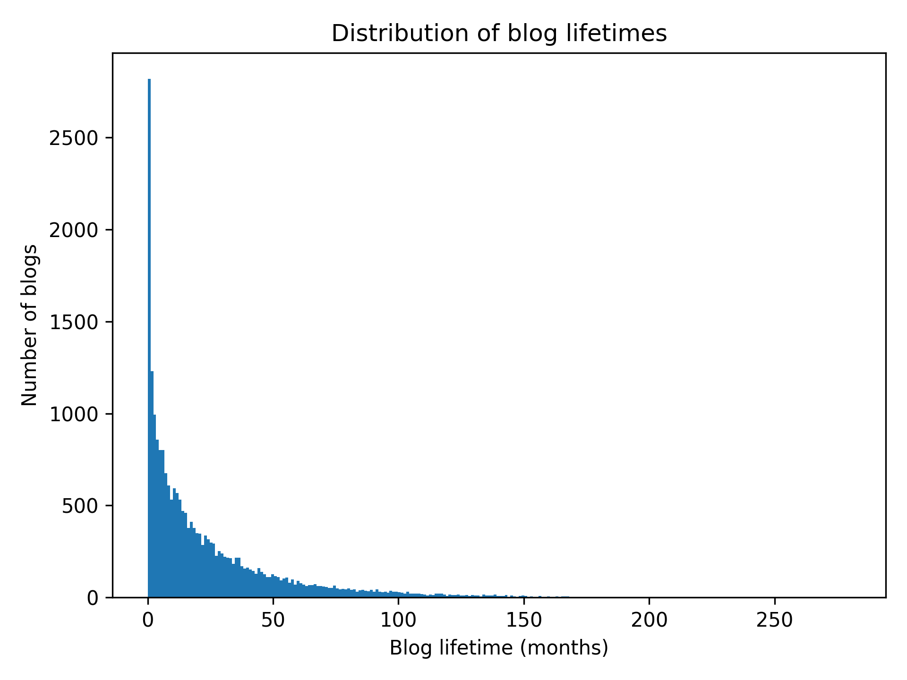
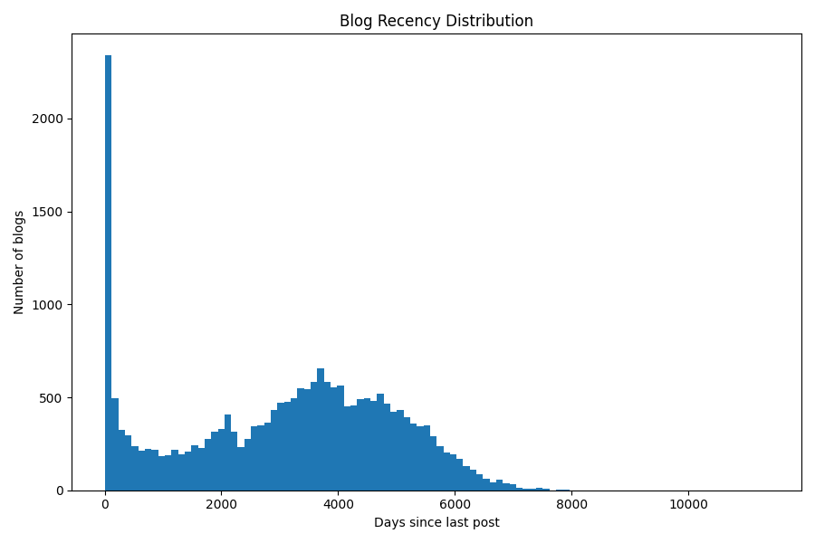

+++
title = "Análise exploratória do dataset BR Crawl"
date = "2026-03-22T12:20:05-03:00"
description = "Análise exploratória realizada no dataset BR Crawl, projeto que indexa a blogosfera brasileira. Vamos entender quais blogs estão sendo indexados, qual o perfil de postagem e buscar padrões nas postagens dos blogs encontrados pelo projeto."
tags = ["português", "data", "python"]
slug = 'analise-exploratoria-do-dataset-br-crawl'
draft = false
toc = true
+++

Nesse post compartilho minha análise exploratória no dataset do
BR Crawl, projeto que indexa a blogosfera brasileira.

## O que é o BR Crawl

O BR Crawl é um projeto que eu iniciei por meados de fevereiro desse ano.
Ele é um software que acessa blogs brasileiros e busca links para outros blogs.

O objetivo é criar um índice aberto de todos os blogs em atividade mantidos
por **autores brasileiros** sem **fins comerciais**. Ou seja, blogs feitos por
pessoas de verdade, sem empresas, spam de SEO, essas coisas.

Não vou entrar muito em detalhes sobre _como_ o BR Crawl funciona, a ideia aqui
é explorar os dados acumulados: até o recorte utilizado na análise (início
de março/2026), eram cerca de 20 mil blogs e ~400 mil postagens.

Se você tem interesse em webscrapping/análise de dados, fica o convite pra
participar do projeto. Ele tem o código aberto no github em <https://github.com/guites/brcrawl>.

Se você gosta de blogs, dê uma olhada no listão do BR Crawl, onde eu
atualizo (quase) todos os dias com as últimas postagens encontradas: <https://guilhermegarcia.dev/brcrawl>.

## O Dataset

O dataset é uma base de dados [SQLite](https://sqlite.org) com cerca de 1gb.

Uma cópia atualizada pode ser acessada neste drive: <https://drive.google.com/drive/folders/1_y7BegOcKMOVtbehaGTN9Fn9gP8Lnn1M>.

O _schema_ revela as tabelas de interesse:

```sql
CREATE TABLE feeds (
    id INTEGER PRIMARY KEY AUTOINCREMENT,
    domain TEXT NOT NULL,
    feed_url TEXT NOT NULL,
    status_id INTEGER NOT NULL,
    created_at DATETIME NOT NULL DEFAULT CURRENT_TIMESTAMP,
    last_checked_at DATETIME,
    last_post_guid VARCHAR,
    last_feed_item_id INTEGER,
    processing_status_id DEFAULT 1,
    FOREIGN KEY (status_id) REFERENCES feed_status(id)
);

CREATE TABLE feed_items (
    id INTEGER PRIMARY KEY AUTOINCREMENT,
    feed_id INTEGER NOT NULL,
    title VARCHAR NOT NULL,
    author VARCHAR,
    content TEXT,
    url VARCHAR NOT NULL,
    guid INTEGER NOT NULL,
    published_at DATETIME NOT NULL,
    created_at DATETIME NOT NULL DEFAULT CURRENT_TIMESTAMP,
    UNIQUE (feed_id, guid),
    FOREIGN KEY (feed_id) REFERENCES feeds(id) ON DELETE CASCADE
);
```

Para cada _feed_ (blog) temos múltiplos _feed_items_ (posts).

Cada feed tem uma data de criação (quando ele foi adicionado ao dataset) e a
data da última checagem, que é quando ele foi visitado pra ver se tinha
postagens novas.

Cada feed_item (post de um blog) tem a data de criação (quando ele foi
adicionado ao dataset) e a data de publicação.

Salvamos também o título, o autor, o link pro post e, quando
disponível, o conteúdo da postagem.

## Análises iniciais

- 24182 blogs diferentes.
- 22294 blogs com pelo menos uma postagem registrada.
- 414357 postagens.

Qual a distribuição das postagens ao longo do tempo? Dado nosso dataset
de 20k+ blogs, qual percentual esteve em atividade de 2020 pra frente? E em 2025/2026?

### Posts por mês



<small>Gerado com o script <a href="./feed_items_per_month.py">feed_items_per_month.py</a>.</small>

O gráfico acima conta todos os posts de todos os blogs.

Podemos calcular os "blogs ativos por mês", contando apenas um post por blog.
Isso reduz o impacto de blogs que postam com frequência muito
acima da média.



<small>Gerado com o script <a href="./community_activity.py">community_activity.py</a>.</small>

O pico de postagens em 2025-2026, que estava muito acima do número de postagens
visto no intervalo de 2010-2017, dá uma boa reduzida quando contamos apenas um
post por blog.

Isso indica grande atividade de um número reduzido de blogs, com maior
aumento de atividade no último ano. Vejo duas explicações possíveis:

- Facilidade cada vez maior em automatizar a geração de conteúdo.
- Viés de seleção: quanto mais antigo for o blog, maior a chance de
perder o domínio, ser deletado, parar de funcionar, etc.

### Surgimento de novos blogs

Podemos estimar a taxa com que novos blogs são criados consultando a data do
primeiro post registrado por cada blog.



<small>Generado com o script <a href="./new_blogs_per_month.py">new_blogs_per_month.py</a>.</small>

<aside>
Devido ao funcionamento dos feeds RSS, não temos como saber se o primeiro post
registrado na base de dados corresponde ao primeiro post do blog em questão:
na verdade estamos medindo o primeiro post <i>observado</i>.
</aside>

### Intervalo de atividade dos blogs

Por quanto tempo os blogs ficam em atividade?

Podemos nos basear no intervalo entre o primeiro e último post registrado
de cada blog:



<small>Gerado com o script <a href="./blog_lifetime.py">blog_lifetime.py</a>.</small>

Como esperado, a maioria dos blogs fica em atividade por pouco tempo, sendo o
valor mais comum 0 meses (blogs com um único post).

A distribuição mostra que a maioria dos blogs fica em atividade por até um ano:

- 1992 blogs com um único post (0 meses de atividade)
- 8568 blogs em atividade de 1 mês a 1 ano
- 6651 blogs em atividade de 1 ano a 3 anos
- 2657 blogs em atividade de 3 a 5 anos
- 2019 blogs em atividade de 5 a 10 anos
- 406 blogs em atividade por mais de 10 anos

### Blogs com atividade recente

Vamos usar o tempo desde o último post como métrica para entender quantos blogs
ainda estão em atividade.



<small>Gerado com o script <a href="./recency_histogram.py">recency_histogram.py</a>.</small>

O gráfico acima foi gerado agrupando as quantidades em 100 caixas (`bins=100`),
com intervalo de 11365 dias entres o post mais antigo e o mais recente.

**Estatísticas** - análise de atividade recente.

|métrica|valor|
|--|--|
|count|22286.000000|
|mean|3075.129678|
|std|1869.874190|
|min|7.000000|
|25%|1594.250000|
|50%|3351.000000|
|75%|4526.000000|
|max|11372.000000|

Distribuição da atividade em intervalos.

|intervalo|quantidade|
|--|--|
|0-1 mês|1476|
|1-3 meses|677|
|3-6 meses|456|
|6-12 meses|591|
|1-2 anos|780|
|2-5 anos|2103|
|5-10 anos|6512|

Isso indica que dos 22286 blogs com posts registrados:

- 6.6% tiveram posts no último mês;
- 14.3% tiveram posts no último ano.

## Próximos passos

Daqui pra frente quero focar no conteúdo dos posts. Tenho interesse em
saber se existem potenciais categorias emergentes baseadas nos assuntos abordados
pelo blogueiros brasileiros.

Qualquer apontamento ou sugestão, fique a vontade pra entrar em contato. Abraço.
