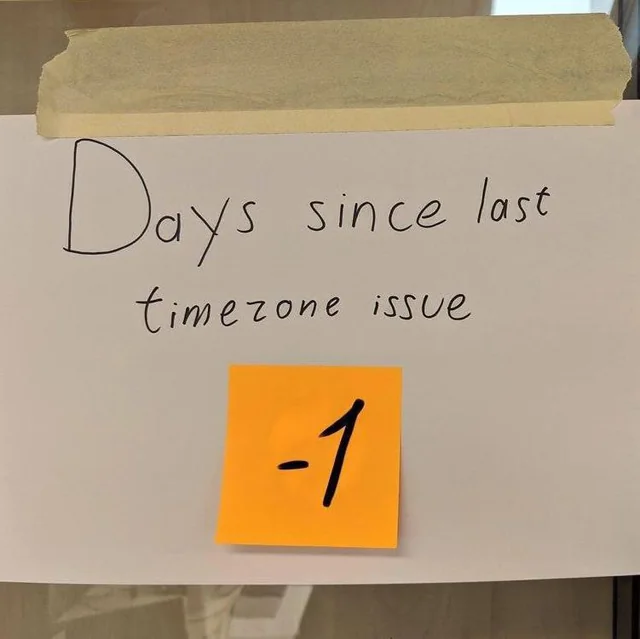

+++
title = "Aware and naive datetime objects without pytz"
date = "2024-01-25T20:44:34-03:00"
description = "How to compare offset naive and offset aware python datetime objects without using external libraries"
tags = ['python', 'english']
slug = 'aware-naive-datetime-objects-wo-pytz'
+++

Maybe you were trying to do a simple datetime comparison, and was met with the following:

    TypeError: can't compare offset-naive and offset-aware datetimes

Most solutions ([1](https://bobbyhadz.com/blog/typeerror-cant-compare-offset-naive-and-offset-aware-datetimes), [2](https://stackoverflow.com/questions/15307623/cant-compare-naive-and-aware-datetime-now-challenge-datetime-end)) will point you towards [pytz](https://pypi.org/project/pytz/), but the lib page at pypi mentions:

> Projects using Python 3.9 or later should be using the support now included as part of the standard library, and third party packages work with it such as tzdata

Let's start by reproducing the problem.

```python
import datetime

start_date=datetime.datetime.strptime("2022-01-01T22:03:30", "%Y-%m-%dT%H:%M:%S")
end_date=datetime.datetime.strptime("2022-01-01T22:03:33Z", "%Y-%m-%dT%H:%M:%S%z")

if start_date >= end_date:
    raise ValueError("Cannot end before you begin!")
```

this block of code raises the `TypeError: can't compare offset-naive and offset-aware datetimes` message.

The [official docs for datetime](https://docs.python.org/3/library/datetime.html#aware-and-naive-objects) mentions

> Date and time objects may be categorized as “aware” or “naive” depending on whether or not they include timezone information.

Well in our date strings (`"2022-01-01T22:03:30"` and `"2022-01-01T22:03:33Z"`), the first one happens to be naive: there's no timezone information included on it.

Both of them include the T, which is just the default separator for [ISO 8601 combined date-time format](https://stackoverflow.com/a/29282022/14427854).

The second one includes the `Z`, which tells us that its in the [Zero timezone](https://en.wikipedia.org/wiki/Time_zone#Notation), or with a zero UTC offset.

> An aware object represents a specific moment in time that is not open to interpretation.

```python
print(start_date.tzinfo) # None
print(end_date.tzinfo) # datetime.timezone.utc
```

Cool. In this situation, we will have to assume that either the aware datetime object is wrong, or the naive object is wrong. Some information will be lost.

Let's say we trust out UTC date is correct:

```python

start_date.replace(tzinfo=datetime.timezone.utc)

... # rest of the code

if start_date >= end_date:
    raise ValueError("Cannot end before you begin!")
```

It works! But we could also assume that our naive object is correct:

```python

end_date.replace(tzinfo=None)

... # rest of the code

if start_date >= end_date:
    raise ValueError("Cannot end before you begin!")
```

also works! But keep in mind that information could be lost. Consider the following:

```python
from datetime import datetime, timezone

br_date = datetime.strptime("2022-01-01T22:03:30-03:00", "%Y-%m-%dT%H:%M:%S%z")
ref_date = datetime.strptime("2022-01-01T22:03:30Z", "%Y-%m-%dT%H:%M:%S%z")

print(br_date > ref_date)  # True

br_date_to_utc = br_date.replace(tzinfo=timezone.utc)

print(br_date_to_utc > ref_date)  # False
```


