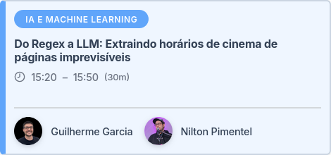
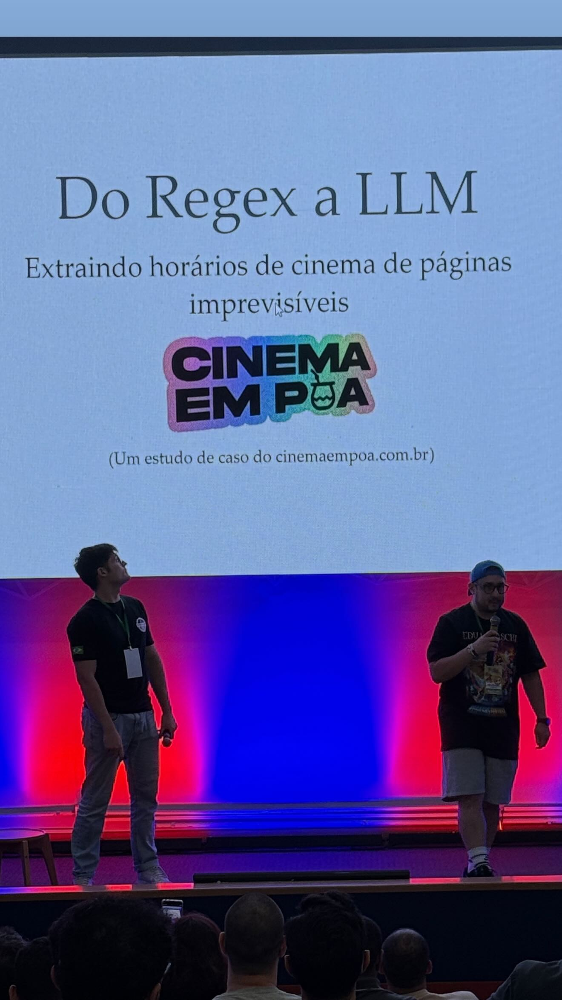

+++
title = "cinemaempoa na pythonsul"
date = "2025-11-22T19:06:05-03:00"
description = "Levamos um estudo de caso do cinemaempoa pra pythonsul de 2025. Neste post eu falo um pouco sobre a apresentação e links para o material."
tags = ["português","python"]
slug = 'cinemaempoa-na-pythonsul'
draft = false
toc = true
+++

Em 21 a 23 de Novembro de 2025 aconteceu o Python Sul 2025 em Porto Alegre.

Junto com o [Nilton Pimentel](https://www.linkedin.com/in/nilton-pimentel/),
submeti uma palestra baseada na implementação do cinemaempoa pra
fazer extração dos horários de filmes que passam no [CineBancários](https://cinebancarios.blogspot.com/).

A ideia foi usar duas LLMs diferentes pra processar as postagens do blog do
cinema e retornar as exibições de filmes em forma estruturada (JSON).

O diferencial foi usar a comparação entre o resultado dos dois modelos pra
criação de alertas: discordâncias entre os modelos são uma ótima métrica pra
detectar erros de extração!

Daí nesses casos, entra um ser humano no fluxo pra realizar a correção.

A implementação deu super certo, e fizemos uma apresentação baseada na
experiência.

Eu subi os slides aqui no site pra registro: <https://guilhermegarcia.dev/slides/cinemaempoa-pysul-2025/>, e o repositório com a implementação original está aqui: <https://github.com/guites/cinemaempoa-pythonsul>.

Bônus: meu nome saiu na camiseta 🖤🖤

Fica o agradecimento ao pessoal da organização, o evento foi sensacional!
