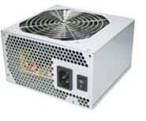
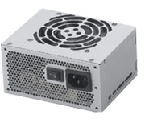
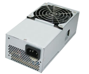
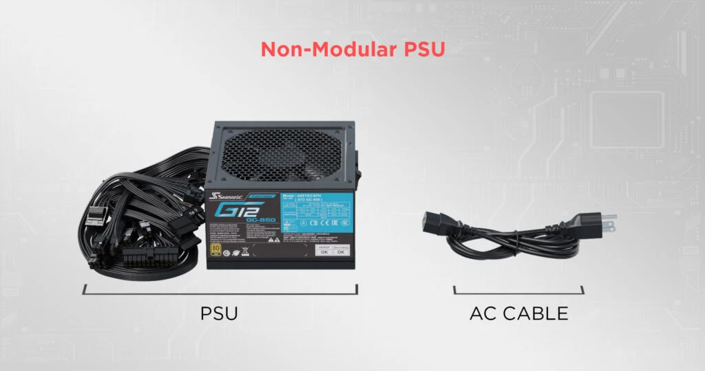
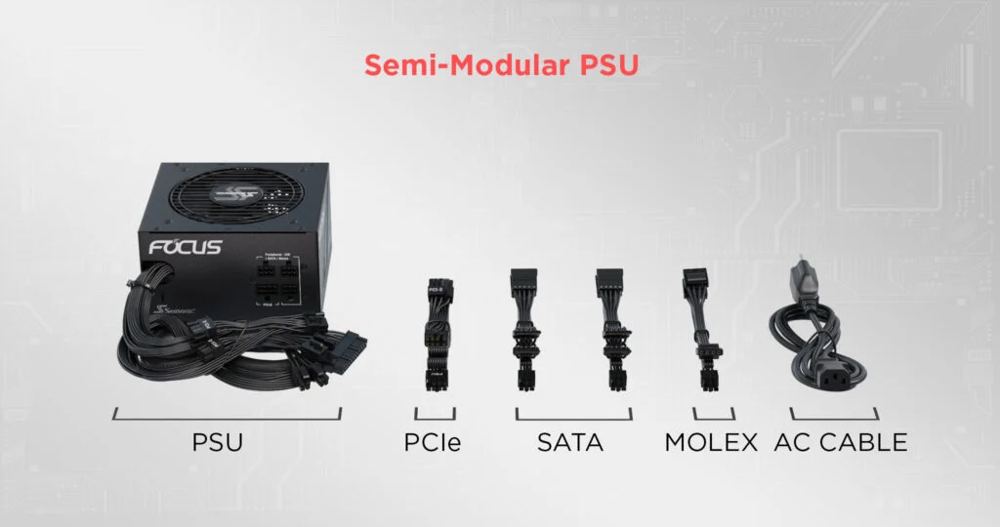
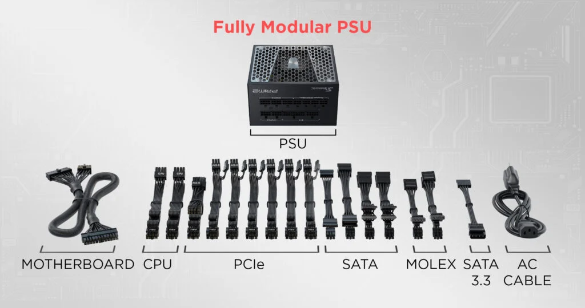

+++
title = "Hackers do bem - Identificar Componentes de Hardware de Computador"
date = "2024-02-01T07:45:06-03:00"
slug = "hackers-do-bem-componentes-hardware"
description = "Resumão do segundo módulo de nivelamento do curso hackers do bem: Identificar componentes de hardware de computador"
tags = ["hackersdobem","português"]
draft = true
toc = true
+++

## Introdução

Este post é um resumo sobre o conteúdo abordado no segundo módulo de nivelamento do curso [hackers do bem](https://hackersdobem.org.br/) que iniciou em 22/01/2024.

A ideia é compartilhar como o conhecimento de cibersegurança está sendo passado para os [centenas de milhares de inscritos](./email-instabilidade-25-01-2024.png) que vão popular o cenário profissional do país.

Os módulos do nivelamento são:

1. Introdução à cibersegurança [visitar](/blog/hackers-do-bem-introd-ciberseguranca)
1. Identificar componentes de hardware de computador (**você está aqui**)
1. Compreender Internet e Camada de acesso à rede
1. Compreender acesso a rede e camada de internet (IP)
1. Compreender IPV6 e Camada de transporte
1. Compreender Camada de Aplicação/Serviços de Rede
1. Utilizar Sistemas Operacionais Windows
1. Utilizar Sistemas Operacionais - Linux
1. Lógica de programação
1. Desenvolvimento de Scripts

A ementa do módulo **Componentes de Hardware de Computadores** começa com grandezas computacionais e sistemas numéricos, passa por arquitetura de hardware, identificação de componentes de hardware e termina com a instalação de sistemas operacionais e criação de ambientes virtuais (virtualização).

As aulas são compostas de textos interativos junto à vídeos gravados pelo instrutor Tulio Saji.

## Aula 1: Grandezas computacionais e sistemas numéricos

O início da informática está ligado com a busca por uma resolução rápida de cálculos complexos.

Alguns marcos no desenvolvimento das máquinas utilizadas são:

- Teoria de Boole - Lógica utilizada pelos computadores
- Máquina de Turing - Base teórica para computação
- ENIAC - Primeiro computador digital

Em 1948 surge o termo **bit (b)**, junção das palavras Binary Digit, que representa a menor unidade computacional (0 ou 1).

Depois é definido o **Byte (B)** como o conjunto de 8 bits, usado para representar caracteres através da tabela ASCII.

A [tabela ASCII](https://www.ascii-code.com) é formada por 256 valores, cada um representando um caracter específico:

<details closed>
<summary>Mais info sobre a tabela ascii</summary>

O total de 256 valores é dado pelo tamanho do byte: são oito bits que podem, cada um deles, ter dois valores. Isso dá uma combinação de 2^8 = 256 valores.

Cada valor nesse intervalo pode ser calculado pela soma das potencias de 2 equivalente a sua posição.

Por exemplo, o caractere A ("a maiúsculo") é definido pelo decimal 65, que em binário é 01000001.

O 65 pode ser encontrado partindo de 01000001 pelo cálculo

```
0  1  0  0  0  0  0  1
|  |  |  |  |  |  |  |
|  |  |  |  |  |  |  |___ 1 * 2^0 = 1 *  1 = 1
|  |  |  |  |  |  |_______0 * 2^1 = 0 *  2 = 0
|  |  |  |  |  |__________0 * 2^2 = 0 *  4 = 0
|  |  |  |  |_____________0 * 2^3 = 0 *  8 = 0
|  |  |  |________________0 * 2^4 = 0 * 16 = 0
|  |  |___________________0 * 2^5 = 0 * 32 = 0
|  |______________________1 * 2^6 = 1 * 64 = 64
|_________________________0 * 2^7 = 0 * 128 = 0

1 + 64 = 65.
```

Da mesma forma, podemos encontrar o equivalente decimal de outros caracteres:

| -             | A   | a   | ç   |
| ------------- | --- | --- | --- |
| 2<sup>7</sup> | 0   | 0   | 1   |
| 2<sup>6</sup> | 1   | 1   | 1   |
| 2<sup>5</sup> | 0   | 1   | 1   |
| 2<sup>4</sup> | 0   | 0   | 0   |
| 2<sup>3</sup> | 0   | 0   | 0   |
| 2<sup>2</sup> | 0   | 0   | 1   |
| 2<sup>1</sup> | 0   | 0   | 1   |
| 2<sup>0</sup> | 1   | 1   | 1   |
| -             | 65  | 97  | 231 |

- os 31 primeiros valores (do 00000000 até o 00011111) são caracteres de controle, que não podem ser impressos.
- do 32 ao 127, são os caracteres comuns, passíveis de impressão, como os numerais e as letras maiúsculas e minúsculas.
- do 128 ao 255 são os caracteres extendidos, contendo valores como o cedilha (ç), letras acentuadas (á, à, ä) e alguns símbolos como ¼, ¿, ¬.
</details>

Existem 2 nomenclaturas para grandezas computacionais:

SI - Sistema internacional, em Base 10: **Kilo**Byte, **Mega**Byte, **Giga**Byte, etc.

IEC - PrefixoBinário, em Base 2: **Kibi**Byte (Kilo Binary), **Mebi**Byte (Mega Binary), etc.

<table>
<thead>
<tr>
<th colspan="3">Sistema Internacional</th>
<th colspan="3">Sistema Binário</th>
</tr>
<tr>
<td>Nome</td>
<td>Simb.</td>
<td>Valor</td>
<td>Nome</td>
<td>Simb.</td>
<td>Valor</td>
</thead>
<tbody>
<tr>
<td>byte</td>
<td>B</td>
<td>1</td>
<td>byte</td>
<td>B</td>
<td>1</td>
</tr>
<tr>
<td>kilobyte</td>
<td>KB</td>
<td>1000B (10<sup>3</sup>B)</td>
<td>kibibyte</td>
<td>KiB</td>
<td>1024B (2<sup>10</sup>B)</td>
</tr>
<tr>
<td>megabyte</td>
<td>MB</td>
<td>1000KB (10<sup>6</sup>B)</td>
<td>mebibyte</td>
<td>MiB</td>
<td>1024KiB (2<sup>20</sup>B)</td>
</tr>
<tr>
<td>gigabyte</td>
<td>GB</td>
<td>1000MB (10<sup>9</sup>B)</td>
<td>gibibyte</td>
<td>GiB</td>
<td>1024MiB (2<sup>30</sup>B)</td>
</tr>
<tr>
<td>terabyte</td>
<td>TB</td>
<td>1000GB (10<sup>12</sup>B)</td>
<td>tebibyte</td>
<td>TiB</td>
<td>1024GiB (2<sup>40</sup>B)</td>
</tr>
<tr>
<td>petabyte</td>
<td>PB</td>
<td>1000TB (10<sup>15</sup>B)</td>
<td>pebibyte</td>
<td>PiB</td>
<td>1024TiB (2<sup>50</sup>B)</td>
</tr>
<tr>
<td>exabyte</td>
<td>EB</td>
<td>1000PB (10<sup>18</sup>B)</td>
<td>exibibyte</td>
<td>EiB</td>
<td>1024PiB (2<sup>60</sup>B)</td>
</tr>
<tr>
<td>zettabyte</td>
<td>ZB</td>
<td>1000EB (10<sup>21</sup>B)</td>
<td>zebibyte</td>
<td>ZiB</td>
<td>1024EiB (2<sup>70</sup>B)</td>
</tr>
<tr>
<td>yottabyte</td>
<td>YB</td>
<td>1000ZB (10<sup>23</sup>B)</td>
<td>yobibyte</td>
<td>YiB</td>
<td>1024ZiB (2<sup>80</sup>B)</td>
</tr>
</table>

Existem também grandezas para **velocidade de transmissão**.

- Internet: Kbps (Kilo bit por segundo), Mbps (Mega bit por segundo).
- Transferência de arquivos: KB/s (Kilo Byte por segundo), MB/s (Mega Byte por segundo).

<aside>Um exemplo é um plano de internet de 700 Mega, que baixa arquivos numa taxa de 87MB/s.<br/>
700 Mbps = 700 / 8 = 87.5 MB/s.</aside>

Outra grandeza utilizada é o conjunto de **grandezas elétricas**:

- Hertz (HZ) - Frequência.

  Comumente utilizada para categorizar o número de ciclos (clock speed) que uma CPU pode realizar por segundo, em gigahertz (GHz). Um número de ciclos maiores indicam uma CPU mais rápida (2.1 GHz é mais lento que 3.6 GHz, para processadores de mesma geração, com o mesmo número de núcleos).

- Volt (V) - Tensão.
- Ampére (A) - Corrente.
- Watt (W) - Potência.

Outras grandezas comuns são:

- Pixel (quantidade de pontos coloridos em uma tela)

  utilizado na resolução de imagens/tela/câmeras. Quanto mais pontos, maior a qualidade da imagem. Pode definir também o tamanho de uma tela (4K - 3840 x 2160, FHD - 1920 x 1080, HD - 1280 x 720).

- DPI (Dots per Inch), define a quantidade de pixels (pontos) por polegada.

### Bases numéricas e conversões

O "nome" da base indica a quantidade de algarismos disponíveis.

Exemplos:

- Base 2 (Binário): 0, 1.
- Base 10 (Decimal): 0, 1, 2, 3, 4, 5, 6, 7, 8, 9.
- Base 16 (Hexadecimal): 0, 1, 2, 3, 4, 5, 6, 7, 8, 9, A, B, C, D, E, F.

A Base 10 possui os algarismos (do 0 ao 9). A base 2 possui apenas dois (0 e 1), enquanto a base 16 possui do 0 ao 9 e do A ao F (totalizando 16).

Para **converter binários e hexadecimal para decimal**, usamos a **Notação Posicional**.

Por ex, o número 6238 pode ser descrito em notação posicional da seguinte forma:

6238 = 6000 + 200 + 30 + 8<br/>
6238 = 6\*1000 + 2\*100 + 3\*10 + 8\*1<br/>
6238 = 6\*10<sup>3</sup> + 2\*10<sup>2</sup> + 3\*10<sup>1</sup> + 8\*10<sup>0</sup><br/>

Quando aplicamos a mesma lógica para binários, temos o seguinte:

11110001<sub>2</sub> = 1\*2<sup>7</sup> + 1\*2<sup>6</sup> + 1\*2<sup>5</sup> + 1\*2<sup>4</sup> + 0\*2<sup>3</sup> +0\*2<sup>2</sup> + 0\*2<sup>1</sup> + 1\*2<sup>0</sup><br/>
11110001<sub>2</sub> = 1\*128 + 1\*64 + 1\*32 + 1\*16 + 0\*8 + 0\*4 + 0\*2 + 1<br/>
11110001<sub>2</sub> = 128 + 64 + 32 + 16 + 0 + 0 + 0 + 1<br/>
11110001<sub>2</sub> = 241<sub>10</sub>

Para hexadecimais:

EFBD998<sub>16</sub> = E\*16<sup>6</sup> + F\*16<sup>5</sup> + B\*16<sup>4</sup> + D\*16<sup>3</sup> + 9\*16<sup>2</sup> + 9\*16<sup>1</sup> + 8\*16<sup>0</sup><br/>
EFBD998<sub>16</sub> = 14\*16<sup>6</sup> + 15\*16<sup>5</sup> + 11\*16<sup>4</sup> + 13\*16<sup>3</sup> + 9\*16<sup>2</sup> + 9\*16<sup>1</sup> + 8\*16<sup>0</sup><br/>
EFBD998<sub>16</sub> = 14\*16777216 + 15\*1048576 + 11\*65536 + 13\*4096 + 9\*256 + 9\*16 + 8\*1<br/>
EFBD998<sub>16</sub> = 234881024 + 15728640 + 720896 + 53248 + 2304 + 144 + 8<br/>
EFBD998<sub>16</sub> = 251386264<sub>10</sub><br/>

Para converter de **números decimais para binários e hexadecimais**, existem diferentes técnicas.

No caso dos binários, podemos utilizar uma sequência de divisões por 2.

O algoritmo consiste em dividir o número inicial por 2, e depois todos os quocientes também por dois, até atingir um quociente menor que 2.

O número convertido vai ser formado pelo resto das divisões somadas ao último quociente, na ordem contrária.

<details closed>
<summary>Clique para ver uma implementação simples desse algoritmo em Python</summary>

```python
def dec_to_bin(dec_number: int, bin_num: str) -> str:
    if dec_number < 2:
        return str(dec_number) + bin_num
    quocient = dec_number // 2
    remainder = dec_number % 2
    return dec_to_bin(quocient, str(remainder) + bin_num)


bin_number = dec_to_bin(347, "")
print(bin_number)  # 101011011
```

</details>


Para conversão de **Base 16 para Base 2** ou **Base 2 para Base 16**, podemos usar uma tabela:

| Hexadecimal | Binário |
| ----------- | ------- |
| 0           | 0000    |
| 1           | 0001    |
| 2           | 0010    |
| 3           | 0011    |
| 4           | 0100    |
| 5           | 0101    |
| 6           | 0110    |
| 7           | 0111    |
| 8           | 1000    |
| 9           | 1001    |
| A           | 1010    |
| B           | 1011    |
| C           | 1100    |
| D           | 1101    |
| E           | 1110    |
| F           | 1111    |

<aside>Repare que o binário equivalente à cada algarismo hexadecimal é a representação binária desse algarismo na base 10, substituindo de A a F por 10 a 15.</aside>

FACA<sub>16</sub> = F(1111) A(1010) C(1100) A(1010)
FACA<sub>16</sub>= 1111 1010 1100 1010<sub>2</sub>

## Aula 2 - CPU, Placa-mãe, Memórias e BIOS/UEFI

Os computadores são formados por conjuntso de peças construídas e instaladas ao redor de um microprocessador. Nessa aula são abordados os seguintes componentes:

- Processador
- Placa-Mãe
- Cooler
- Memória RAM
- HDD/SSD
- Fonte
- Placas Offboard

### Processador (CPU)

O processador, ou CPU (**C**entral **P**rocessing **U**nit), é definido em função de algumas características:

- Frequência de processador (Velocidade, clock)

  medido em hertz (comumente Ghz), indica a capacidade de processar informações de forma sequêncial.

- Núcleos (cores)

  processadores modernos costumam ter múltiplos núcleos. Indicam a capacidade de processar informações em paralelo.

- Cache

  memória usada na transmissão de informações entre o processador e outros conponentes.

- Arquitetura

  processadores podem ter arquiteturas X86 (32 bits) - CISC, X64 (64bits) - CISC ou ARM - RISC.

- Fabricantes

  - AMD: séries Ryzen (3, 5, 7 e 9) gerações Zen\* (1000, 2000, 3000, 5000, 7000);
  - Intel: Core I (I3, I5, I7, I9) de 1ª à 13ª geração.
  - Apple: Linha M (M1, M2, M3).

É bom se familiarizar com a nomenclatura usada pelos diferentes fabricantes.

No exemplo da AMD, temos o seguinte formato:

```
AMD Ryzen 7 3700X
 |   |    | ||  |__ indicador de alta performance
 |   |    | ||
 |   |    | ||_____ variação da série
 |   |    | |
 |   |    | |______ série 3000
 |   |    |
 |   |    |________ modelo
 |   |
 |   |_____________ marca
 |
 |_________________ fabricante
```

Existem os seguintes indicadores para processadores da AMD:

- X: Alta performance
- G: Vídeo Integrado
- U: Baixo consumo
- 3D: Empilhamento de Cache

Para a Intel temos:

```
Intel Core I7 11700F
  |     |  |   | | |_ indicador de "sem vídeo integrado"
  |     |  |   | |
  |     |  |   | |___ variação da geração
  |     |  |   |
  |     |  |   |_____ geração 11
  |     |  |
  |     |  |_________ modelo
  |     |
  |     |____________ marca
  |
  |__________________ fabricante
```

A Intel usa os seguintes indicadores:

- K: Alto desempenho/desbloqueado
- F: Sem vídeo integrado
- S: Edição especial
- U: eficiência energética

O processador precisa de um **Cooler** para manutenção da temperatura.

O processador precisa ser compatível com a placa mãe e o cooler selecionados.

### Placa mãe

A placa mãe interliga todos os componentes necessários para funcionamento do computador.

Os componentes podem ser considerados "onboard" ou "offboard", onde a placa mãe pode ter alguns recursos, como placa de som, placa de rede e outros, integrados direto na placa mãe (chamados de "onboard").

As principais conexões feitas na placa mãe são:

1. Socket para conexão do processador
2. Slots de memória RAM
3. Slot PCIe, para conexão de periféricos como placas de vídeo ou SSDs.
4. Chipset, responsável pela comunicação entre os diversos componentes da placa mãe.
5. Bateria BIOS/UEFI, responsável por manter a hora do sistema entre boots.
6. BIOS.

   Responsável pelo boot do sistema e comumente chamada de BIOS, mas computadores mais novos utilizam a especificação UEFI.

7. Conector 24 pinos para alimentação da placa mãe.
8. Conector 8 pinos para alimentação da CPU.
9. Conector SATA, para discos rígidos e SSDs.
10. M.2 (SATA / NVMe), comumente usado para conectar SSDs.

Existem alguns formatos padronizados de placa mãe: ATX, mATX e ITX. Onde o ITX é para gabinetes menores, e possui menos conexões.

### Memórias

A memória do computador é responsável por armazenar dados, mas também impacta na velocidade de utilização e troca de dados.

Elas são separadas entre voláteis e não voláteis.

**Voláteis**:

- Ram (SIMM, DIMM, SDR, DDR, DDR2, DDR3, DDR4, DDR5, etc)
- Cache (L1, L2, L3)
- Vídeo (GDDR3, GDDR4, GDDR5, GDDR6, HBM, HBM2)

**Não voláteis**:

- ROM (PROMs, EPROMs, EEPROMs, Memória flash)
- Armazenamento em massa (Pendrive, SSD, HD)

<aside><em>Volátil</em> nesse contexto se refere a duração dos dados memória, onde uma memória volátil não persiste os dados ao desligarmos o computador.</aside>

**Memória ROM**: Read Only Memory - Memória somente de leitura

- PROM - Programmable ROM

  evolução da ROM, podia ser comprada vazia e gravada pelo usuário.

- EPROM - Erasable PROM

  permite que os dados sejam apagados. Nas versões usadas na década de 90, a remoção dos dados era feito focando luz ultravioleta em uma parte específica da memória.

- EEPROM - Electrically EPROM

  permite apagar as informações de forma elétrica, por exemplo para apagar os dados e atualizar a BIOS.

- Flash

  permite apagar as informações de forma eletrônica. É o padrão nas BIOS de computadores atuais.

**Memória RAM**: Random Access Memory - Memória de Acesso Aleatório.

Memória que salva os dados em endereços aleatórios, de forma não sequêncial.

- _SIMM_: até 32mb, 30 ou 72 vias, usados até o Pentium 1.
- _DIMM_ até 512mb, 168 vias, usados até o Pentium 3.
- _DDR_ (Double Data Rate), até 400MHz, 1GB de memória, usados até o Pentium 4.
- _DDR2_, até 1066MHz, 8GB de memória, usados até o Core 2 duo/quad.
- _DDR3_, até 1866MHz, 16GB de memória, usados até a 6ª geração do Intel Core.
- _DDR4_, até 5433 MHz, 64GB de memória, em uso nas gerações atuais do Intel Core.
- _DDR5_, até 8400 MHz, 512GB de memória, em uso nas gerações atuais do Intel Core.

## Aula 3 - Armazenamento, Fonte, Placas Offboard e Gabinete

Para que o computador funcione é necessária a instalação de um sistema operacional e outros dados. Esses dados devem ser armazenados em algum dispositivo.

- HDs (Hard Drives) - Discos Rígidos
- CDs / DVDs / Blu-rays - Mídias Óticas removíveis
- Pendrives / Cartões de Memória
- SSDs

<aside>O Ubuntu possui versões <a href="https://ubuntu.com/tutorials/create-a-usb-stick-on-ubuntu#1-overview">iniciáveis através de USBs</a> ou <a href="https://help.ubuntu.com/community/LiveCD">CDs</a> que podem ser usados para rodar o sistema operacional sem passar pela etapa de instalação.</aside>

### HD - Disco rígido

São discos mecânicos, com motores e cabeças de leitura, e a gravação ocorre de forma magnética.

Vantagens:

- Custo por GB mais baixo
- Longevidade

Desvantagens:

- Velocidade de leitura e gravação (lenta em relação aos SSDs)
- Baixa resistência a impactos (derrubar, bater, etc, pode danificar os dados armazenados)

<details closed>
<summary>Vídeos de HDs em operação</summary>

<video controls style="max-width: 100%;" src="./hd-wo-cover.webm"></video><br/>
<small>Fonte: <a href="https://www.youtube.com/watch?v=ojGvHDjHPb4">https://www.youtube.com/watch?v=ojGvHDjHPb4</a></small>

<video controls style="max-width: 100%;" src="./hd-slowmo-guys.webm"></video><br/>
<small>Fonte: <a href="https://www.youtube.com/watch?v=3owqvmMf6No">https://www.youtube.com/watch?v=3owqvmMf6No</a></small>

<p>Os HDs são compostos de partes pesadas em movimento, e datacenters antigos sofriam muito com vibrações. O vídeo abaixo mostra como até mesmo gritar com um HD pode gerar latência e problemas de performance. Aviso: volume alto.</p>

<video controls style="max-width: 100%;" src="./shouting-datacenter.webm"></video><br/>
<small>Fonte: <a href="https://www.youtube.com/watch?v=tDacjrSCeq4">https://www.youtube.com/watch?v=tDacjrSCeq4</a></small>

</details>

Os discos rígidos são conectados na placa mãe através de uma conexão SATA (Serial Advanced Technology Attachment). Um disco rígido vai aceitar duas conexões, uma para a transferência de dados (o conector menor) e uma para a energia (o conector maior).



Discos rígidos mais antigos utilizavam conexão PATA (Parallel Advanced Technology Attachment), que podem ser identificados pelo cabo de transmissão de dados.



Os conectores SATA existem em três versões:

- SATA I (revisão 1.x) conhecida como SATA 1.5Gb/s (~180MB/s)
- SATA II (revisão 2.x) conhecida como SATA 3Gb/s (~375MB/s)
- SATA III (revisão 13x) conhecida como SATA 6Gb/s (~750MB/s)

Atualmente, os conectores SATA, enquanto ainda utilizados, estão em processo de substituição pelos conectores M.2.

### Midias Óticas

Os mais comuns foram os CDs, DVDs e Blu-ray.

| Mídia   | Armazenamento | Velocidade de Leitura \* |
| ------- | ------------- | ------------------------ |
| CD      | 700MB         | 150KB/s                  |
| DVD     | 4.7GB         | 1.35 MB/s                |
| Blu-Ray | 25GB          | 4.5 MB/s                 |

<aside><strong>*</strong>: A maioria das mídias óticas possui variações na velocidade de leitura, escrita e regravação em função do hardware disponível. Velocidades de leitura comuns para CDs são 24X(cerca de 3.6MB/s), 48X(7.2MB/s) e, em drivers modernos, até 72X (10.8MB/s). (ver <a href="https://kb.iu.edu/d/adme">https://kb.iu.edu/d/adme</a> e <a href="https://en.wikipedia.org/wiki/Blu-ray#Drive_speeds">https://en.wikipedia.org/wiki/Blu-ray#Drive_speeds</a>).</aside>

### Flash (pendrives e cartões de memória)

São formas de armazenamento removíveis que utilizam memória flash. Os mais comuns são os pendrives e cartões SD e micro SD.

<aside>A memória flash é um tipo de <strong>EEPROM</strong>, onde os dados são escritos e apagados eletronicamente. Os EEPROMs são, tradicionalmente, lentos. As memórias flash, porém, possuem uma <strong>fiação interna</strong> que auxilia no processo de remoção de dados através da aplicação de um campo elétrico no circuito interno da memória, ao invés de alterar bytes de um por um, como nas EEPROMs normais. Fonte: <a href="https://edisciplinas.usp.br/pluginfile.php/343991/mod_resource/content/1/MEM%C3%93RIA%20FLASH_2013.pdf">https://edisciplinas.usp.br/pluginfile.php/343991/mod_resource/content/1/MEM%C3%93RIA%20FLASH_2013.pdf</a></aside>

São divididos em classes em função da velocidade de escrita e leitura:

- Classes 2, 4 ou 6: até 12.5MB/s.
- High speed: até 25MB/s (conhecidos também por _classe 10_).
- UHS-I: entre 50 e 104MB/s.
- UHS-II: entre 156 e 312MB/s.

As classes UHS-I e UHS-II são popularmente utilizadas em cameras profissionais de alta resolução.

### SSDs

Os SSDs (Solid State Drives) utilizam uma variante da memória flash para armazenar informações.

O processo de leitura e gravação, de natureza eletronica, apresenta velocidade na ordem de 10x maior que os discos rígidos tradicionais (HDs).

Existem alguns modelos de SSDs disponíveis no mercado, entre eles:

- SSD SATA 2,5": formato de HD para notebook, com conexão SATA III, com velocidades de transmissão em torno de 500MB/s (sequencial).

  <aside>As memórias flash podem ser divididas em dois tipos: <strong>Flash NOR</strong> (Not OR) e <strong>Flash NAND</strong> (Not AND). O tipo NOR permite acesso às células de memória de forma aleatória, como ocorre na memória RAM, o que possibilita maiores velocidades, enquanto o tipo NAND trabalha com acesso sequencial às células de memória.<p>O tipo NOR é usado em chips de BIOS ou firmwares de smartphones, enquanto o tipo NAND é o mais comum nos SSDs.</p>Fonte: <a href="https://www.infowester.com/ssd.php#flash">https://www.infowester.com/ssd.php#flash</a>.</aside>

- SSD M.2 SATA: Velocidades iguais ao SSD SATA 500MB/s, mas tem um formato mais prático, não precisando dos cabos separados para ligar na placa mãe.
- SSD M.2 NVMe (Non-Volatile Memory Express), pode ter diferentes velocidades:
  - Gen 3 velocidades até 4000MB/s
  - Gen 4 velocidades até 8000MB/s
  - Gen 5 velocidades até 16000MB/s

Os SSDs M.2 SATA se diferenciam, na aparência, dos SSDs M.2 NVMe devido ao padrão do conector.

O SSD M.2 SATA usa o padrão **B+M Key**, enquanto o SSD M.2 NVMe usa o padrão **M Key**.



Os SSDs M.2 possuem tamanho tabelados, descritos no formato 22XXX, onde 22mm é a sua largura e os digitos finais definem seu comprimento em milímetros.



### Fonte

A fonte recebe energia da rede e converte para a tensão de funcionamento do computador, transformando a corrente alternada em contínua.

Existem padrões baseados no tamanho da fonte, como ATX, SFX e TFX (e múltiplas variações de cada umdeles), onde o TFX é o formato de fonte mais compacto entre os três.

<figure>
  
  
  
  <figcaption>Formatos de fonte. Da esquerda para a direita, ATX, SFX e TFX. Fonte: <a href="https://www.silverstonetek.com/en/tech-talk/10055">https://www.silverstonetek.com/en/tech-talk/10055</a></figcaption>
</figure>

Elas podem ser classificadas em função do cabeamento, podendo ser:

1.  Não modulares: todos os cabos são presos à fonte, e devem ser mantidos mesmo quando não utilizados.

    <br/>
    <small>Fonte: <a href="https://www.cgdirector.com/full-vs-semi-vs-non-modular-power-supply/">https://www.cgdirector.com/full-vs-semi-vs-non-modular-power-supply/</a></small>

2.  Semi modulares: alguns conectores, como o de 24 pinos, PCIe e CPU, já vem soldados na fonte, enquanto outros cabos, como SATA ou IDE, podem ser desconectados ou trocados.

    <br/>
    <small>Fonte: <a href="https://www.cgdirector.com/full-vs-semi-vs-non-modular-power-supply/">https://www.cgdirector.com/full-vs-semi-vs-non-modular-power-supply/</a></small>

3.  Full modulares: todos os cabos, incluindo o cabo da placa mãe, podem ser removidos.

    <br/>
    <small>Fonte: <a href="https://www.cgdirector.com/full-vs-semi-vs-non-modular-power-supply/">https://www.cgdirector.com/full-vs-semi-vs-non-modular-power-supply/</a></small>

A fonte deve fornecer conectores específicos, para que sejam alimentados os outros componentes do computador: SATA, PCI-e (6+2 pinos), CPU (4+4 pinos), Placa mãe (20 + 4 pinos), 12vHPWR (16 pinos), entre outros.

<aside>É importante cuidar na hora de conectar os cabos, pois um cabo PCI-e com 6+2 pinos pode ser encaixado, erroneamente, na entrada da CPU (que possui dois conjuntos de 4 pinos separáveis). Isso pode acabar queimando os componentes!</aside>



A **escolha da fonte** depende de alguns fatores, como:

- Consumo da CPU
- Consumo da GPU
- Quantidade de memória
- Quantidade de discos

Recomenda-se o uso de calculadores de fonte, como [essa (coolerMaster)](https://www.coolermaster.com/power-supply-calculator/) ou [essa (outerVision)](https://outervision.com/power-supply-calculator).

Existe uma certificação, a [80 plus](https://www.clearesult.com/80plus/), que garante um valor mínimo de eficiência energética em função da carga.

| Certificação     | 20% Carga | 50% Carga | 100% Carga |
| ---------------- | --------- | --------- | ---------- |
| 80 Plus Standard | 80%       | 80%       | 80%        |
| 80 Plus Bronze   | 82%       | 85%       | 82%        |
| 80 Plus Silver   | 85%       | 88%       | 85%        |
| 80 Plus Gold     | 87%       | 90%       | 87%        |
| 80 Plus Platinum | 90%       | 92%       | 89%        |
| 80 Plus Titanium | 92%       | 94%       | 90%        |

<figure>
  
  
  
  
  
  
  <figcaption>Certificados 80 PLUS para fontes 115V. Da esquerda para a direita, Standard, Bronze, Silver, Gold, Platinum, Titanium. Fonte: <a href="https://www.clearesult.com/80plus/">https://www.clearesult.com/80plus/</a></figcaption>
</figure>

Um parâmetro para classificar a eficiência energética de uma fonte é a presença de um PFC (Power Factor Correction) passivo ou ativo.

| Fonte               | Eficiência | Perda de energia |
| ------------------- | ---------- | ---------------- |
| Fonte sem PFC       | 50 % a 65% | 35% a 50%        |
| Fonte com PFC ativo | 80 % a 99% | 1% a 20%         |

Quanto maior a eficiência energética da fonte, menos energia é dissipada no seu funcionamento, nos mecanismos internos, ou retornada para a rede, garantindo maior fidelidade na alimentação dos componentes do computador.

### Placas Offboard

Placas Offboard, ou expansoras, são integradas à placa mãe na busca por maior desempenho, mais recursos, ou para substituir componentes onboard com defeito.

A placa de vídeo (GPU) é um dos principais componentes offboard utilizados.

Algumas fabricantes de placas de vídeo são:

- Intel (linha ARC): lançada em 2022, concorrendo com a AMD e NVIDIA. Seus últimos lançamentos são as placas A770, A750, A580, A380, A310, onde a A770 equivale a uma RTX3060/RTX3060TI.
- AMD (linha Radeon): lançadas inicialmente nos anos 90, seus últimos lançamentos são as séries RX7600 / RX7700XT / RX7800XT / RX7900GRE / RX7900XT / RX7900XTX.
- NVIDIA (linha GeForce): lançadas inicialmente também nos anos 90, seus últimos lançamentos são as placas RTX4060 / RTX4060TI / RTX4070 / RTX4070TI, etc.

A placa de som também é um componente comumente utilizado de forma offboard.

As placas de rede, ligadas através do PCI-express, podem ter velocidades de 1Gbps até 10Gbps, ou até 2Gbps usando placas sem fio.

<aside>Essas velocidades se referem à rede interna. Para conexões pela internet, a velocidade ainda vai ser limitada pelo plano do provedor.</aside>

Outros componentes e placas utilizados em formato offboard são:

- Placas para captura de vídeo
- Adaptadores NVMe
- Adaptadores SATA
- Processadores de IA ou mineração

### Gabinete

O gabinete, desktop ou case, é responsável por organizar os componentes de forma a otimizar o uso do espaço disponível, levando em conta fatores como o fluxo de ar entre os componentes.

Existem alguns tamanhos tabelados:

- Full tower (placas mãe até E-ATX ou XL-ATX)
- Mid Tower (Até placas ATX)
- Mini Tower (placas até mATX ou ITX)

A escolha do gabinete deve levar em conta:

- Tamanho da placa mãe
- Altura máxima do Cooler
- Tamanho máximo da GPU
- Tamanho máximo da fonte
- Quantidade de ventoinhas
- Airflow
- Estética

## Aula 4 - Instalação de SO

Essa aula tem como foco bootar um computador com Windows 10, Ubuntu 23.10 e utilizar o software ProxMox.

O professor começa mostrando como criar um pen drive, usando o [Ventoy](https://www.ventoy.net/en/download.html), contendo um [ISO do Windows 10](https://www.microsoft.com/pt-br/software-download/windows10ISO), do [Ubuntu 23.10](https://ubuntu.com/download) e o software [Proxmox](https://www.proxmox.com/en/downloads).

Depois, é feita a instalação em um computador com o SSD zerado, começando pelo windows, e depois o Ubuntu, optando pela opção de limpar todas as partições, ou seja, não é feito o dual boot.

Por fim, é feita a instalação do Proxmox, e criado a partir dele uma máquina virtual rodando windows.

## Aula 5 - Virtualização

A virtualização é o uso do software para criar uma camada sobre o hardware que permite os elementos do computador sejam divididos em vários computadores virtuais, chamados de **VMs**.

Numa estrutura normal, temos o hardware, no qual instalamos o sistema operacional, que gerencia os aplicativos utilizados pelo usuário final.


<aside>O <strong>kernel</strong> é a parte do sistema operacional que faz a ligação entre o hardware e os processos do computador. É chamado de kernel (miolo ou núcleo) pois opera de dentro do sistema operacional. As principais responsabilidades do kernel são:

- Determinar qual o próximo processo a ser executado pela CPU, e por quanto tempo.
- Monitorar quanta memória está sendo utilizado e com qual propósito.
- Servir como um interpretador entre o hardware e os processos.
- Receber requisições de serviço dos processos através das chamadas de sistema (system calls).

Fonte: <a href="https://www.baeldung.com/cs/os-kernel">https://www.baeldung.com/cs/os-kernel</a>.

</aside>

### Tipo 1 ou _Bare Metal_

Um primeiro formato de virtualização **(tipo 1 ou _Bare Metal_)** envolve o uso de um software Hypervisor (como o Proxmox utilizado anteriormente), que vai gerenciar a divisão do hardware entre as diferentes máquinas virtuais.


### Tipo 2 (Máquinas Virtuais - VMs)

A virtualização de **tipo 2** é uma forma menos otimizada, utilizando o Hypervisor instalado em cima do Sistema Operacional do Host. Alguns softwares para esse formato são VMWare, Virtualbox, QEMU.


A vantagem dessa configuração é que ela permite a utilização regular do SO do Host, não dedicando a máquina integralmente à virtualização.

### Containers

Uma terceira forma de virtualização é através do uso de **Containers**.

Na virtualização por containers, vamos ter um único sistema operacional, instalado no host, no qual instalamos o software gerenciador dos containers, que vai compartilhar o kernel do sistema operacional entre os seus aplicativos.


<aside>
Uma dúvida comum é: se os containers compartilham o kernel do SO com o host, como eu consigo rodar um container de linux num computador macOS?

Versões mais antigas do Docker utilizavam VMs de forma otimizada, por baixo dos panos, [rodando softwares como o VirtualBox](https://stackoverflow.com/a/43384588/14427854).

[Este post no blog do Docker](https://www.docker.com/blog/introducing-linuxkit-container-os-toolkit/) fala sobre como é necessário que o sistema operacional do host tenha uma versão de Linux inclusa para que possa rodar containers linux.

A solução utilizada pelo Docker, atualmente, é o [linuxkit](https://github.com/linuxkit/linuxkit), um software que conversa com softwares hypervisores locais de cada sistema operacional (como Windows ou macOS) para gerenciar a instalação e disponibilização das versões Linux necessárias na criação dos containers.</aside>

## Conclusão

Esse segundo módulo, bem mais extenso que o primeiro, é uma introdução muito gentil ao universo dos computadores.

Pra mim fez muito sentido, pois estou começando a mexer com hardware e sistemas operacionais, no processo de desmontar máquinas antigas e instalar linux em vários HDs.

<style>.hide-masterrace{display: none; width: 200px; position: fixed; bottom: 0; left: 0;} .hover-masterrace:hover .hide-masterrace {display: block;} </style>

O professor parece ser <span class="hover-masterrace">um entusiasta do hardware</span> e trouxe vários exemplos de computadores montados, tanto reais quanto no [PC Building Simulator](https://store.steampowered.com/app/621060/PC_Building_Simulator/), o que deixou as aulas mais dinâmicas.

A parte sobre os sistemas operacionais foi bem básica, cobrindo apenas a instalação do Windows 10 e Ubuntu, mas a discussão sobre virtualização tem vários insights e eu, que já uso Docker há um bom tempo, tirei bastante proveito em pesquisar mais a fundo.

Abraço!
